# mochibella

An open source trackball.

*Figure 1: PLA case

### Design Principles
- Symmetrical design; Must allow switch hands in anytime
- Fingerball; Supreme precision with 40mm trackball; Must have control surface for 3+ fingers (>3/5 surface is available)
- Never need to lift off any finger from the ball
- Push-to-click; Utilize buttons as pivot point
- Twist-to-scroll; Utilize dual sensor
- Low profile. With my slim breakout pcb. https://github.com/badjeff/paw3222-pcb
- Powered by [ZMK](https://github.com/zmkfirmware/zmk) => OSS, on-devie profiling, say no to (Logxtxxh|Razxx) eco-system
- No screws; Snapfit only; Must be easy & fast to repair broken clips
- Wireless; Long battery life
- Silent tactile switches

### Gallery

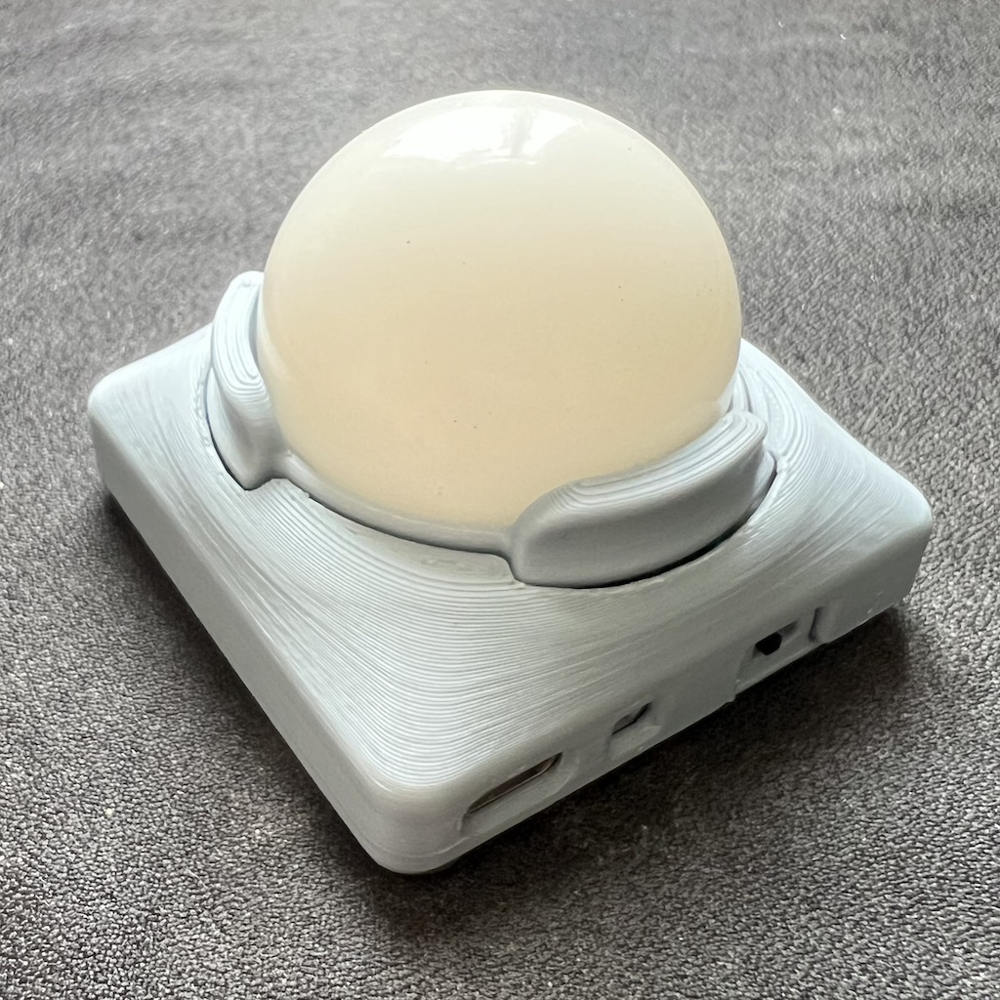
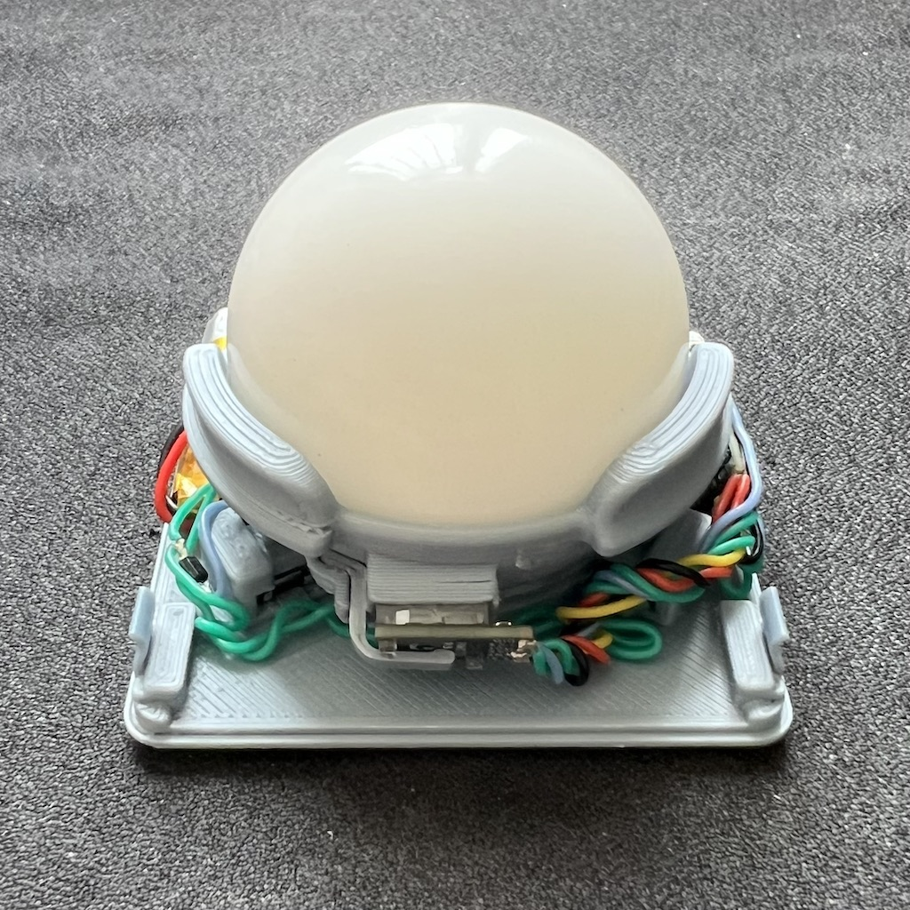
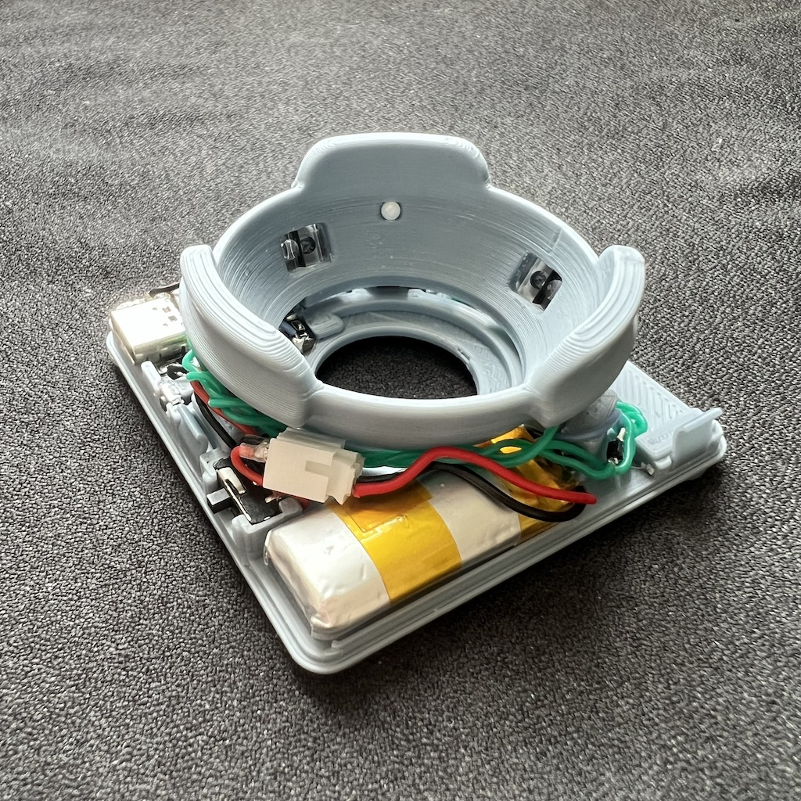
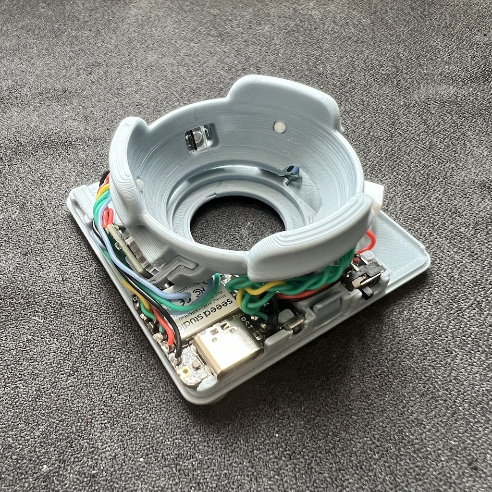
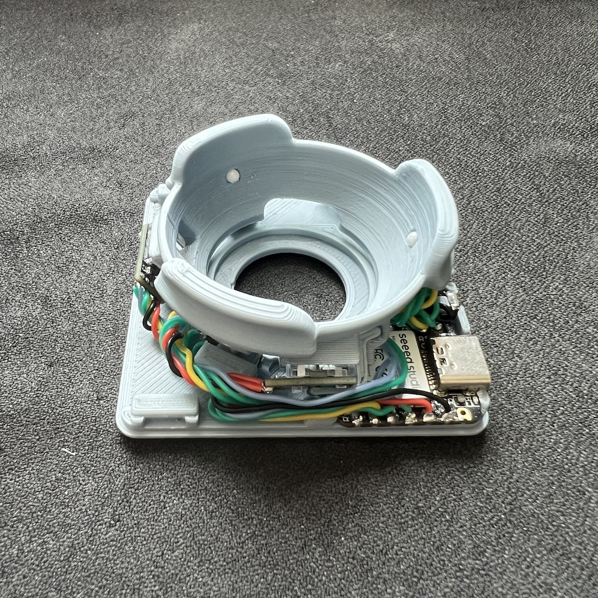
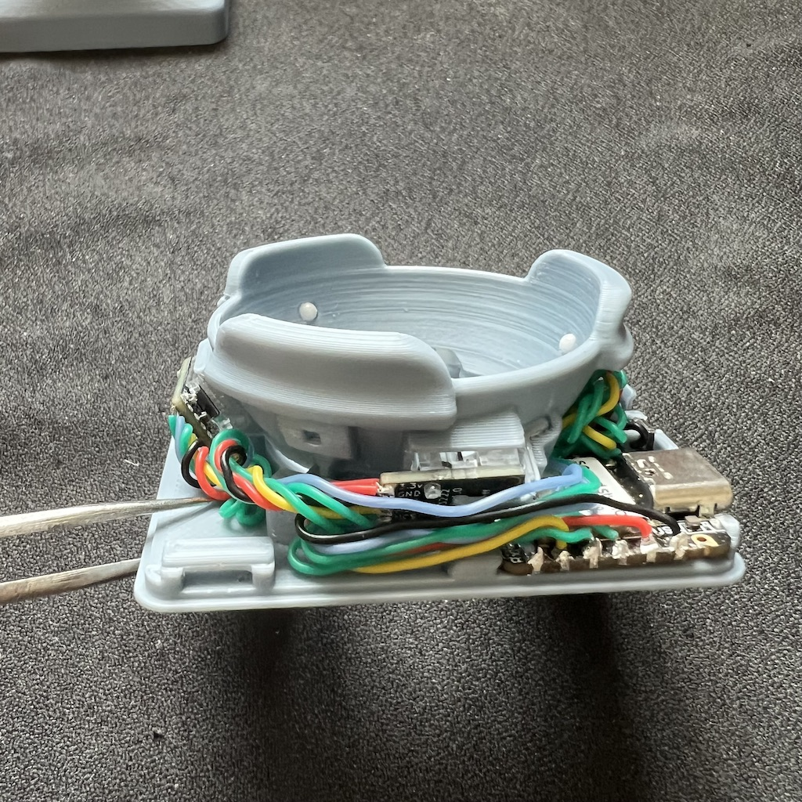
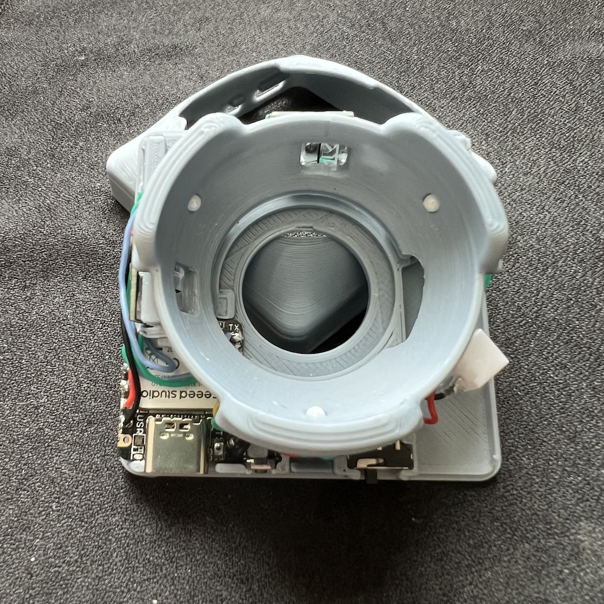

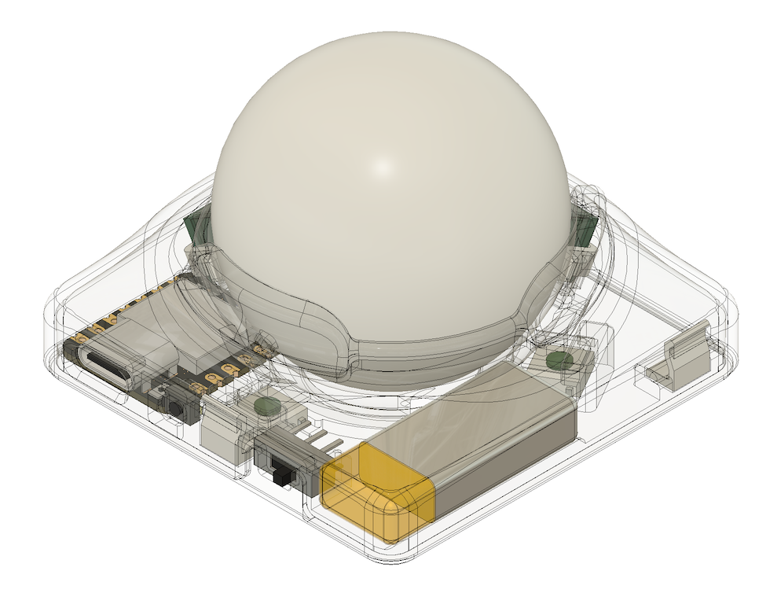
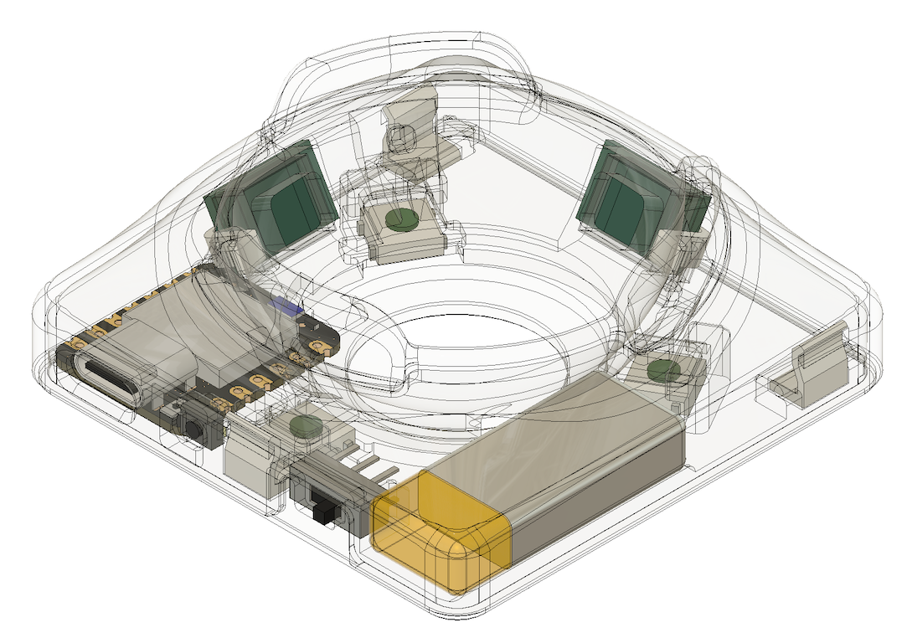
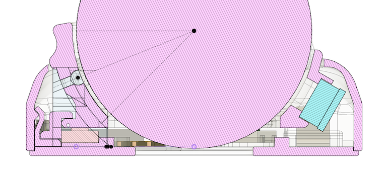
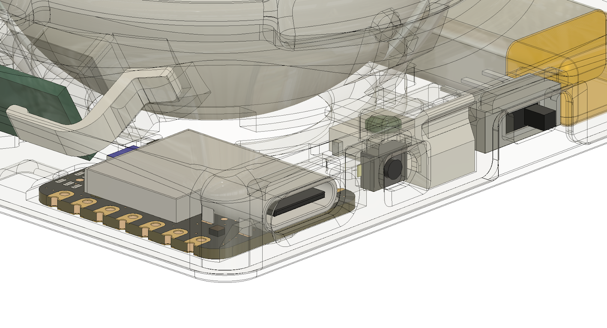

### BOM
|Unit|Item|
|-|-|
|1|Seeed Studio XIAO BLE (nRF52840)|
|2|PAW3222LU-TJDU Sensor with PNSR-015-RB3 Lens [Breakout Board](https://github.com/badjeff/paw3222-pcb)|
|1|40mm trackball. or, pom ball from ebay/aliexpress|
|3|6.4mm(W) Micro Switch. APLS SKHUAKE010 2.5mm(H), or APLS SKRAAWE010 3.5mm(H)|
|3|1N4148W T4 SOD-123 Diode|
|1|MSK-1153 6 Pins Power Switch|
|1|3x4x2mm Tact Switch Turtle Switch|
|3|Static ceramic bearings; 2.5mm|
|1|601230 Lipo Battery (plus connector)|
|4|Non-Slip Silicone Sticker (>1mm thick)|
|1|28/26 AWG silicone wire|

### Building Guide / Tips

- NOT for beginner. Requiring experience of building at least one wireless keyboard on [ZMK](https://github.com/zmkfirmware/zmk).
- MUST have a funcation brain. Requiring to puzzling to assemble all parts together.
- NEED very good eyesight, and soldering skill (and tools)
- Weight of the trackball and actuation force of switches is corelated, it'd be adjusted in CAD file by moving its pivot position. My trackball used is ~44g and the micro switch is SKRAAWE010 0.64N. Simple physics.
- Choose the `base-{switch-height}mm.stl` file respectively for your switch option.
- Axis reading from dual sensor is mixed to report 3 degree of freedom in firmware. Some coefficients is cooked for twist-to-scroll in `mochibella-zmk-config`, not hardcoded in ZMK module.
- The firmware is cooked for low-latency HID trnasportation. e.g. USB, or dongle mode with [zmk-feature-split-esb](https://github.com/badjeff/zmk-feature-split-esb).

### Firmware

The ZMK firmware config repository can be find at [badjeff/mochibella-zmk-config](https://github.com/badjeff/mochibella-zmk-config).

## License

Available under the [CERN-OHL-P v2](/LICENSE) permissive license.
